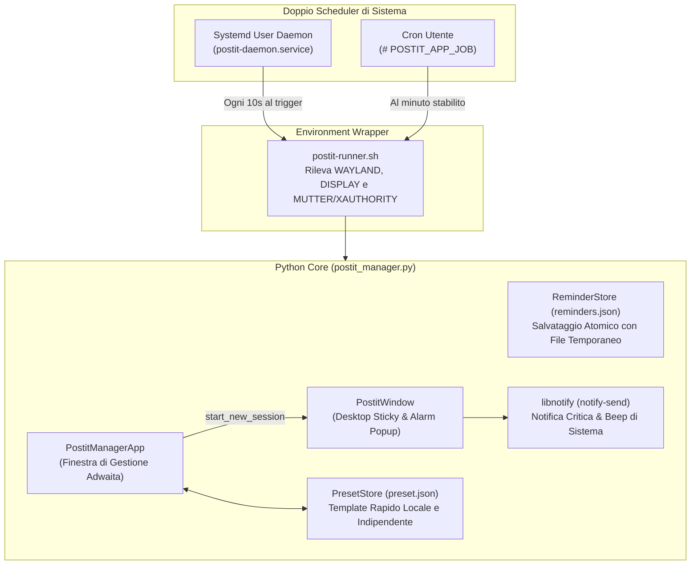

# 📌 Promemoria Post-it per Linux

<p align="left">
  <strong>Lingua / Language:</strong> 
  <a href="README.md">🇬🇧 <strong>English</strong></a> | 
  <a href="README.it.md">🇮🇹 <strong>Italiano</strong></a>
</p>

[](LICENSE)
[-orange.svg)]()
[]()
[]()
[]()

Un'utilità desktop leggera, moderna e flessibile progettata per ambienti Linux per non dimenticare mai scadenze importanti, turni lavorativi, fogli ore o attività ricorrenti.

A differenza delle notifiche tradizionali effimere che scompaiono dopo pochi secondi, **Promemoria Post-it** genera vere e proprie schede interattive in sovraimpressione (*Always on Top*) con pulsanti d'azione diretti per il browser, note adesive indipendenti per il desktop, palette cromatica personalizzabile, formattazione ricca del testo, un **sistema di Preset Rapidi completamente configurabile** e un doppio scheduler ad alta affidabilità (**Systemd User Service + Cron**).

---

## 📸 Caratteristiche Principali

- **⏰ Promemoria Orari in Sovraimpressione Forzata (*Always on Top*)**:
  All'orario impostato (es. ore `18:00` da Lunedì a Venerdì o orario a scelta), la scheda appare automaticamente in primo piano su tutte le finestre, emette un segnale acustico di sistema e invia una notifica desktop di sistema con `notify-send`.
- **🌐 Collegamenti Rapidi Diretti**:
  Grandi pulsanti d'azione cliccabili per aprire al volo nel browser predefinito gli indirizzi web configurati (es. gestionali aziendali, ticket, fogli ore, documentazione o siti personali).
- **📌 Modalità "Post-it sul Desktop" Indipendente**:
  Puoi posizionare qualsiasi Post-it sul desktop e **chiudere l'applicazione principale**: la nota continua a vivere in modo autonomo!
  - Include un interruttore **📌 / 🔓** per scegliere se bloccarla in primo piano o lasciarla sotto le finestre di lavoro per non intralciare.
  - Se lasciata sotto le altre finestre, **all'orario stabilito salta automaticamente in primo piano sopra tutto**!
  - Se la nota viene chiusa prima dell'orario, **il demone di background la fa riapparire all'orario esatto**!
- **⭐ Preset Rapido 100% Personalizzabile**:
  Nessun dato o URL predefinito hardcoded nel repository:
  - Crea o compila il tuo promemoria preferito e clicca su **"⭐ Salva come Preset"**.
  - Il tuo template viene memorizzato nel file locale `preset.json`.
  - Il pulsante in cima al modulo si trasforma in **"⚡ Carica Preset: [Nome]"** per ricompilare tutti i campi con un solo click.
  - Il preset **rimane memorizzato anche se elimini il promemoria originario** dalla lista!
  - Puoi sovrascriverlo in qualsiasi momento impostando un nuovo post-it come preset.
- **🌐 Supporto Bilingue (Italiano / Inglese) e Auto-rilevamento**:
  Rileva automaticamente la lingua di sistema configurata nell'ambiente desktop e adatta tutti i testi, gli avvisi, i dialoghi e i pulsanti delle note adesive. Permette inoltre di cambiare lingua a caldo tramite il selettore in alto o da riga di comando con `--lang`.
- **🎨 Palette Temi Colore (6 Varianti Pastello)**:
  - 🟡 Giallo Classico (Default Post-it)
  - 🟢 Verde Menta
  - 🔵 Azzurro Cielo
  - 🟣 Lilla Lavanda
  - 🟠 Arancio Pesca
  - 🌸 Rosa Pastello
- **✍️ Toolbar di Formattazione Testo Avanzata**:
  Supporto per **Grassetto**, *Corsivo*, <u>Sottolineato</u>, ==Evidenziatore Giallo==, • Elenchi Puntati e Intestazioni H3.
- **🐧 Compatibilità Universale Linux (Wayland & X11)**:
  Funziona nativamente su **Ubuntu, Fedora, Arch Linux, Debian, openSUSE** e su qualsiasi Desktop Environment (**GNOME, KDE Plasma, XFCE, Cinnamon, Sway, Hyprland**).
- **🛡️ Integrazione Perfetta con la Dock di Sistema**:
  Classe `postit-manager` e `StartupWMClass` coerenti con icone vettoriali e raster hicolor (nessun ingranaggio generico nella dock!).

---

## 🏗️ Architettura Tecnica (Guida per Programmatori)

L'applicazione è sviluppata in **Python 3** utilizzando **Tkinter/ttk** per garantire il minimo impatto di memoria RAM (< 15 MB) senza dipendenze pesanti come Electron, Qt o librerie browser embedded.

### 📁 Struttura del Progetto

```text
postit-reminders/
├── install.sh                  # Installer intelligente universale multi-distro
├── uninstall.sh                # Script di disinstallazione e pulizia
├── LICENSE                     # Licenza open-source MIT
├── README.md                   # Documentazione in lingua inglese
├── README.it.md                # Documentazione in lingua italiana
├── .gitignore                  # Regole git
├── src/
│   ├── postit_manager.py       # Core applicazione Python (GUI + Store + Scheduler + Preset)
│   └── postit-runner.sh        # Wrapper shell per l'ambiente grafico universale
├── assets/
│   ├── icon.svg                # Icona vettoriale scalabile FreeDesktop
│   ├── icon.png                # Icona master PNG 256x256
│   ├── generate_icons.py       # Generatore automatico icone per tema hicolor
│   └── icons/                  # Risoluzioni pronte (32, 48, 64, 128, 256)
├── desktop/
│   └── postit-manager.desktop  # Spec FreeDesktop con StartupWMClass
└── systemd/
    └── postit-daemon.service   # Unit file Systemd User per monitor continuo
```

### ⚙️ Dettagli di Ingegneria del Software



1. **Risoluzione Problema Xwayland / Mutter Auth su GNOME Wayland**:
   Su Wayland moderno, processi lanciati in background o da Cron non ereditano l'autenticazione del display server. Lo script `postit-runner.sh` risolve dinamicamente:
   - Trova i token temporanei `/run/user/$UID/.mutter-Xwaylandauth.*` (GNOME) e `/run/user/$UID/xauth_*` (KDE).
   - Esporta `XDG_RUNTIME_DIR`, `DBUS_SESSION_BUS_ADDRESS`, `WAYLAND_DISPLAY` e `DISPLAY=:0`.
2. **Doppio Scheduler Ridondante**:
   - **Systemd User Service (`postit-daemon.service`)**: demone leggerissimo in background che monitora `reminders.json` ogni 10 secondi e controlla i lockfile di runtime (`/run/user/$UID/postit-app/window_<ID>.active`). Se la nota non è aperta o è stata chiusa, la lancia in sovraimpressione.
   - **Crontab atomico**: sincronizzato automaticamente delimitando le righe con `# POSTIT_APP_JOB`.
3. **PresetStore Locale e Disaccoppiato**:
   La classe `PresetStore` gestisce la persistenza del preset rapido in `~/.local/share/postit-app/preset.json`. I dati del preset sono indipendenti dagli elementi della lista dei promemoria: se l'utente elimina il promemoria dal quale ha generato il preset, il template rimane conservato per futuri utilizzi.
4. **Processi Post-it Indipendenti dal Padre**:
   Quando si preme *"Metti sul Desktop"*, la nota viene generata come nuovo gruppo di sessione (`start_new_session=True`). L'applicazione di gestione può essere chiusa liberamente senza interrompere le note attive.
5. **Rendering Tipografico Modulare**:
   La funzione `render_formatted_text()` esegue un tokenizzatore regex compatibile con Markdown e applica dinamicamente tag Tkinter (`bold`, `italic`, `underline`, `highlight`, `bullet`, `header`).
6. **Rilevamento Dinamico dei Font di Sistema**:
   La funzione `get_system_font_family()` interroga i font disponibili del sistema operativo, assegnando `Ubuntu` su Ubuntu, `Cantarell` su Fedora, `Noto Sans` su Arch e `DejaVu Sans` come fallback.

---

## 📦 Requisiti e Dipendenze

- **Python**: `>= 3.8`
- **Tkinter**: `python3-tk` (Debian/Ubuntu) o `python3-tkinter` (Fedora/RHEL) o `tk` (Arch)
- **Notifiche desktop**: `libnotify` / `notify-send`
- **Demone pianificazione**: `systemd` (consigliato) e/o `cron` / `cronie`

---

## 🚀 Installazione Rapida

### 1. Clona il Repository

```bash
git clone https://github.com/oscar-pell/postit-reminders.git
cd postit-reminders
```

### 2. Esegui l'Installatore Universale

```bash
chmod +x install.sh
./install.sh
```

L'installatore rileverà automaticamente la tua distribuzione Linux, installerà le eventuali dipendenze mancanti, configurerà i file in `~/.local/bin`, registrerà il servizio `systemd --user` e aggiungerà il lanciatore desktop nel menu delle applicazioni.

---

### 💻 Installazione Manuale delle Dipendenze (per Distribuzione)

Se preferisci installare manualmente i pacchetti di sistema prima di eseguire lo script:

#### 🔹 Ubuntu / Debian / Linux Mint / Pop!_OS:
```bash
sudo apt update
sudo apt install -y python3 python3-tk libnotify-bin cron
```

#### 🔹 Fedora / RHEL / Rocky Linux:
```bash
sudo dnf install -y python3 python3-tkinter libnotify cronie
```

#### 🔹 Arch Linux / Manjaro / EndeavourOS:
```bash
sudo pacman -S --needed python tk libnotify cronie
```

#### 🔹 openSUSE (Tumbleweed / Leap):
```bash
sudo zypper install -y python3 python3-tk libnotify-tools cron
```

---

## 📖 Guida all'Uso e Configurazione

### 1. Avvio dell'Applicazione

Puoi aprire il gestore principale in due modi:
- **Dal menu applicazioni**: premi il tasto <kbd>Super</kbd> (Windows) e cerca **"Promemoria Post-it"**.
- **Da terminale**:
  ```bash
  postit-manager
  ```

### 2. Creare un Nuovo Promemoria

1. **Orario**: Inserisci l'orario nel formato `HH:MM` a 24 ore (es. `18:00`, `09:30`, `13:00`).
2. **Frequenza**: Seleziona tra *"Lun-Ven (Giorni feriali)"* oppure *"Ogni Giorno"*.
3. **Colore**: Scegli uno dei 6 cerchi colorati per cambiare lo sfondo del post-it.
4. **Titolo**: Scrivi il titolo dell'avviso.
5. **Testo e Formattazione**:
   - Usa la toolbar per applicare **G (Grassetto)**, *C (Corsivo)*, <u>S (Sottolineato)</u>, 🟡 Evidenziatore o elenchi puntati.
6. **Collegamenti Rapidi**:
   - Inserisci facoltativamente fino a 2 URL con la rispettiva etichetta (es. portali aziendali, ticket, fogli ore, repository, link di riunione Google Meet/Teams).
7. Clicca **"💾 Salva Promemoria"**.

### 3. Gestione del Preset Rapido Personale ⭐

Per salvare un promemoria ricorrente come Preset riutilizzabile:
- **Dal Form**: compila i campi e clicca su **"⭐ Salva come Preset"**.
- **Dalla Tabella**: seleziona una riga e clicca su **"⭐ Imposta come Preset"**.

Una volta impostato:
- Il pulsante in cima al form mostrerà **"⚡ Carica Preset: [Titolo] ([Orario])"**.
- Cliccandolo, i campi del form verranno autocompilati all'istante con i tuoi dati.
- I dati restano salvati nel tuo file locale `~/.local/share/postit-app/preset.json` anche se elimini la nota di partenza dalla tabella!
- Se desideri cambiare preset, ti basta selezionare o compilare un altro post-it e cliccare nuovamente su **"⭐ Imposta come Preset"** per sovrascriverlo.

### 4. Azioni nella Tabella dei Promemoria

- **📌 Metti sul Desktop** *(oppure doppio click sulla riga)*: apre subito la nota adesiva sul desktop.
  - Puoi spostarla dove preferisci.
  - Con il tasto in alto a destra **"🔓 Normale (Desktop)"** puoi farla andare sotto le finestre di lavoro.
  - **All'orario impostato salterà automaticamente sopra tutte le finestre** con avviso visivo e sonoro!
- **👁️ Testa Allarme Ora**: simula immediatamente la comparsa in sovraimpressione forzata.
- **🗑️ Elimina**: rimuove il promemoria e aggiorna istantaneamente sia il database sia Cron.

---

## ⌨️ Comandi da Riga di Comando (CLI)

Il binario `postit-manager` (o `postit-runner.sh`) supporta vari argomenti per l'integrazione con script e cronjob:

```bash
# Apri l'interfaccia grafica principale
postit-manager

# Forza una lingua specifica dell'interfaccia ('it' per italiano o 'en' per inglese)
postit-manager --lang it

# Mostra il popup di allarme per uno specifico promemoria
postit-manager --popup --alarm --id <ID_PROMEMORIA>

# Apri il promemoria come nota adesiva desktop libera
postit-manager --desktop --id <ID_PROMEMORIA>

# Stampa tutti i promemoria salvati in formato JSON su stdout
postit-manager --list

# Risincronizza manualmente il crontab di sistema in modalità headless
postit-manager --sync-cron

# Avvia il demone monitor in foreground (usato dal servizio systemd)
postit-manager --daemon
```

---

## 🗑️ Disinstallazione e Pulizia Completa

Puoi disinstallare e ripulire completamente il sistema usando lo script automatico oppure eseguendo manualmente i comandi.

### Metodo 1: Tramite Script Automatico (Consigliato)

```bash
cd postit-reminders

# Rimuove l'applicazione, il servizio di background e le icone (mantiene i promemoria salvati):
./uninstall.sh

# OPPURE: Rimuove e cancella COMPLETAMENTE tutto (inclusi i promemoria e le impostazioni salvate):
./uninstall.sh --purge
```

---

### Metodo 2: Comandi Manuali Universali (Validi per qualsiasi distribuzione Linux)

Se hai cancellato la cartella del repository o vuoi rimuovere tutto manualmente da terminale:

```bash
# 1. Arresta e disabilita il servizio utente Systemd
systemctl --user disable --now postit-daemon.service 2>/dev/null || true
rm -f ~/.config/systemd/user/postit-daemon.service
systemctl --user daemon-reload

# 2. Ripulisci le voci generate automaticamente dal Crontab
crontab -l 2>/dev/null | sed '/POSTIT_APP_JOB/d' | sed '/=== BEGIN POSTIT_APP_JOBS/,/=== END POSTIT_APP_JOBS/d' | crontab - 2>/dev/null || true

# 3. Elimina gli eseguibili e il symlink da ~/.local/bin
rm -f ~/.local/bin/postit-manager ~/.local/bin/postit-runner.sh ~/.local/bin/postit_manager.py

# 4. Elimina il lanciatore Desktop e le icone di sistema
rm -f ~/.local/share/applications/postit-manager.desktop
rm -f ~/.local/share/icons/hicolor/scalable/apps/postit-manager.svg
rm -f ~/.local/share/icons/hicolor/*/apps/postit-manager.png
rm -f ~/.local/share/pixmaps/postit-manager.*

# Aggiorna la cache del desktop
update-desktop-database ~/.local/share/applications 2>/dev/null || true
gtk-update-icon-cache -f -t ~/.local/share/icons/hicolor 2>/dev/null || true

# 5. (Opzionale) Elimina tutti i dati e le impostazioni salvate
rm -rf ~/.local/share/postit-app
rm -rf /run/user/$(id -u)/postit-app
```

---

### 📦 Rimozione Opzionale delle Dipendenze di Sistema

Se desideri disinstallare anche i pacchetti di sistema installati per questa app:

- **Ubuntu / Debian / Linux Mint / Pop!_OS**:
  ```bash
  sudo apt remove -y python3-tk libnotify-bin
  ```
- **Fedora / RHEL / Rocky Linux**:
  ```bash
  sudo dnf remove -y python3-tkinter libnotify
  ```
- **Arch Linux / Manjaro**:
  ```bash
  sudo pacman -R tk libnotify
  ```
- **openSUSE (Tumbleweed / Leap)**:
  ```bash
  sudo zypper remove -y python3-tk libnotify-tools
  ```

---

## 📄 Licenza

Rilasciato sotto licenza [MIT](LICENSE). Libero per uso personale e commerciale, modificabile e ridistribuibile.
