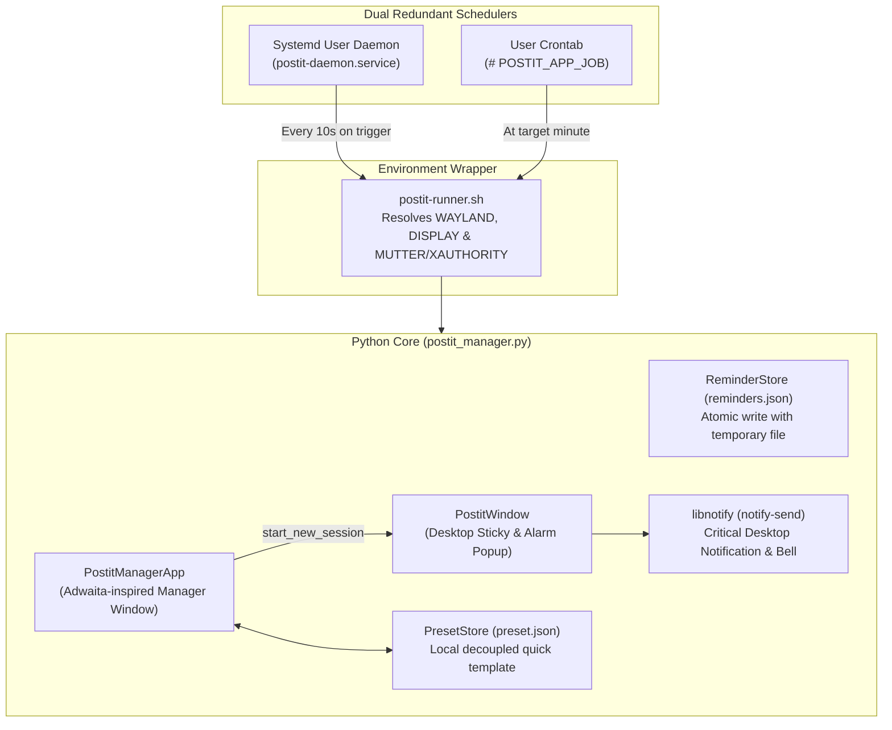

# 📌 Post-it Reminders for Linux

<p align="left">
  <strong>Language / Lingua:</strong> 
  <a href="README.md">🇬🇧 <strong>English</strong></a> | 
  <a href="README.it.md">🇮🇹 <strong>Italiano</strong></a>
</p>

[](LICENSE)
[-orange.svg)]()
[]()
[]()
[]()

A lightweight, modern, and flexible desktop utility designed for Linux environments so you never forget crucial deadlines, shifts, timesheets, or recurring daily tasks.

Unlike traditional ephemeral desktop notifications that fade away after a few seconds, **Post-it Reminders** provides interactive overlay cards (*Always on Top*) with direct browser action buttons, standalone desktop sticky notes, customizable color palettes, rich text formatting, a **100% customizable Quick Preset engine**, and a high-reliability dual scheduler (**Systemd User Service + Cron**).

---

## 📸 Key Features

- **⏰ Scheduled Forced Overlay Alerts (*Always on Top*)**:
  At your specified time (e.g. `18:00` Monday through Friday or any custom schedule), the card automatically pops up above all open windows, rings a system bell, and triggers a critical desktop notification with `notify-send`.
- **🌐 Direct Action Link Buttons**:
  Large, easily clickable buttons to instantly open configured portals or websites in your default browser (e.g. ERPs, ticket trackers, timesheets, documentation, or personal links).
- **📌 Standalone "Desktop Sticky Note" Mode**:
  Place any Post-it note directly onto your desktop and **safely close the main manager app**: the note stays alive as an independent process!
  - Includes a quick **📌 / 🔓** toggle button to choose between keeping it pinned on top or letting it rest beneath your active work windows.
  - If left under other windows, **it automatically jumps to the foreground above everything at the designated time**!
  - If you close the note before its scheduled time, **the background daemon automatically brings it back on time**!
- **⭐ 100% Customizable Quick Preset**:
  Zero private or hardcoded URLs in the repository:
  - Fill in your preferred reminder parameters and click **"⭐ Save as Preset"**.
  - Your template is stored in your private local file `~/.local/share/postit-app/preset.json`.
  - The button at the top of the form turns into **"⚡ Load Preset: [Name]"** to re-populate the form in a single click.
  - The preset **persists even if you delete the original reminder** from your list!
  - You can overwrite it at any time by setting a new post-it as preset.
- **🌐 Bilingual UI & System Locale Detection**:
  Automatically detects your desktop environment language (`it` or `en`) and adapts all UI text, sticky notes, notifications, and dialogs. Allows live runtime language switching from the top header bar or via the `--lang` flag.
- **🎨 Color Theme Palettes (6 Pastel Options)**:
  - 🟡 Classic Yellow (Default Post-it)
  - 🟢 Mint Green
  - 🔵 Sky Blue
  - 🟣 Lavender Purple
  - 🟠 Peach Orange
  - 🌸 Pastel Pink
- **✍️ Rich Text Formatting Toolbar**:
  Inline support for **Bold**, *Italic*, <u>Underline</u>, ==Yellow Highlight==, • Bulleted Lists, and H3 Section Headers.
- **🐧 Universal Linux Compatibility (Wayland & X11)**:
  Works out of the box on **Ubuntu, Fedora, Arch Linux, Debian, openSUSE** across any Desktop Environment (**GNOME, KDE Plasma, XFCE, Cinnamon, Sway, Hyprland**).
- **🛡️ Native Dock & Taskbar Integration**:
  Proper `postit-manager` class and `StartupWMClass` matching with scalable SVG and hicolor raster icons (no generic gear icon in your dock!).

---

## 🏗️ Technical Architecture (Developer Guide)

Built in **Python 3** using native **Tkinter/ttk** to ensure minimal RAM consumption (< 15 MB) without heavy runtimes like Electron, Qt, or embedded web browsers.

### 📁 Repository Structure

```text
postit-reminders/
├── install.sh                  # Universal multi-distro smart installer
├── uninstall.sh                # Clean uninstaller and system purger
├── LICENSE                     # MIT Open Source License
├── README.md                   # English documentation (this file)
├── README.it.md                # Italian documentation
├── .gitignore                  # Git ignore rules
├── src/
│   ├── postit_manager.py       # Core application (GUI + Store + Schedulers + Preset)
│   └── postit-runner.sh        # Universal graphical environment shell wrapper
├── assets/
│   ├── icon.svg                # FreeDesktop vector scalable icon
│   ├── icon.png                # Master 256x256 PNG icon
│   ├── generate_icons.py       # Automatic icon builder for hicolor theme
│   └── icons/                  # Pre-rendered icon sizes (32, 48, 64, 128, 256)
├── desktop/
│   └── postit-manager.desktop  # FreeDesktop spec launcher with StartupWMClass
└── systemd/
    └── postit-daemon.service   # Systemd User Unit for background monitor
```

### ⚙️ Software Engineering Highlights



1. **Solving the Xwayland / Mutter Auth Problem on Wayland**:
   On modern Wayland desktops, background processes or Cron jobs do not inherit graphical session credentials. The `postit-runner.sh` script dynamically detects:
   - Temporary auth tokens: `/run/user/$UID/.mutter-Xwaylandauth.*` (GNOME) and `/run/user/$UID/xauth_*` (KDE).
   - Exports `XDG_RUNTIME_DIR`, `DBUS_SESSION_BUS_ADDRESS`, `WAYLAND_DISPLAY`, and `DISPLAY=:0`.
2. **Dual Redundant Schedulers**:
   - **Systemd User Service (`postit-daemon.service`)**: a lightweight background daemon monitoring `reminders.json` every 10 seconds and tracking runtime lockfiles (`/run/user/$UID/postit-app/window_<ID>.active`). If a note is not open or was closed, it raises the overlay window.
   - **Atomic Crontab**: synchronized automatically using `# POSTIT_APP_JOB` tags.
3. **Decoupled Local PresetStore**:
   The `PresetStore` class persists user presets in `~/.local/share/postit-app/preset.json`. Template data is independent from items in the active reminders list.
4. **Parent-Independent Processes**:
   When launching *"Put on Desktop"*, the note process is spawned with `start_new_session=True`. The manager application can be closed without interrupting any sticky notes.
5. **Modular Text Renderer**:
   `render_formatted_text()` parses inline Markdown tokens and maps them to Tkinter tags (`bold`, `italic`, `underline`, `highlight`, `bullet`, `header`).
6. **Dynamic System Font Detection**:
   `get_system_font_family()` queries installed system fonts at runtime, selecting `Ubuntu` on Ubuntu, `Cantarell` on Fedora, `Noto Sans` on Arch, and `DejaVu Sans` as fallback.

---

## 📦 Requirements & Dependencies

- **Python**: `>= 3.8`
- **Tkinter**: `python3-tk` (Debian/Ubuntu) or `python3-tkinter` (Fedora/RHEL) or `tk` (Arch)
- **Desktop notifications**: `libnotify` / `notify-send`
- **Scheduler**: `systemd` (recommended) and/or `cron` / `cronie`

---

## 🚀 Quick Installation

### 1. Clone the Repository

```bash
git clone https://github.com/oscar-pell/postit-reminders.git
cd postit-reminders
```

### 2. Run the Universal Installer

```bash
chmod +x install.sh
./install.sh
```

The installer automatically detects your Linux distribution, installs missing packages via your package manager, registers the binaries in `~/.local/bin`, starts the `systemd --user` service, and installs application launcher icons.

---

### 💻 Manual Dependency Installation (by Distribution)

If you prefer installing dependencies manually before running `./install.sh`:

#### 🔹 Ubuntu / Debian / Linux Mint / Pop!_OS:
```bash
sudo apt update
sudo apt install -y python3 python3-tk libnotify-bin cron
```

#### 🔹 Fedora / RHEL / Rocky Linux:
```bash
sudo dnf install -y python3 python3-tkinter libnotify cronie
```

#### 🔹 Arch Linux / Manjaro / EndeavourOS:
```bash
sudo pacman -S --needed python tk libnotify cronie
```

#### 🔹 openSUSE (Tumbleweed / Leap):
```bash
sudo zypper install -y python3 python3-tk libnotify-tools cron
```

---

## 📖 Configuration & User Guide

### 1. Launching the Application

Open the main manager in either of two ways:
- **Application Menu**: press <kbd>Super</kbd> (Windows key) and search for **"Promemoria Post-it"** (or Post-it Reminders).
- **Terminal**:
  ```bash
  postit-manager
  ```

### 2. Creating a Reminder

1. **Time**: Enter the time in 24-hour `HH:MM` format (e.g. `18:00`, `09:30`, `13:00`).
2. **Frequency**: Select *"Lun-Ven (Giorni feriali)"* (Mon-Fri) or *"Ogni Giorno"* (Daily).
3. **Color**: Pick one of the 6 color circles to style the note.
4. **Title**: Enter a title for the alert.
5. **Message Formatting**:
   - Use the toolbar to apply **B (Bold)**, *I (Italic)*, <u>U (Underline)</u>, 🟡 Highlight, or bullet points.
6. **Action Links**:
   - Optionally add up to 2 URLs with custom labels (e.g. internal portals, issue trackers, documentation, video meeting links).
7. Click **"💾 Salva Promemoria"** (Save Reminder).

### 3. Setting Your Personal Quick Preset ⭐

To save a recurring template:
- **From the Form**: fill in the fields and click **"⭐ Salva come Preset"**.
- **From the Table**: select any existing reminder and click **"⭐ Imposta come Preset"**.

Once saved:
- The top button displays **"⚡ Carica Preset: [Title] ([Time])"**.
- Clicking it instantly populates the form with your saved parameters.
- Presets persist in `~/.local/share/postit-app/preset.json` even if the original note is deleted!

### 4. Table Actions

- **📌 Metti sul Desktop** *(or double-click row)*: opens the sticky note on your desktop immediately.
  - Drag it anywhere on screen.
  - Use the top-right button **"🔓 Normale (Desktop)"** to send it behind work windows.
  - **It will automatically pop up above everything when the scheduled time arrives**!
- **👁️ Testa Allarme Ora**: immediately tests the forced overlay mode.
- **🗑️ Elimina**: deletes the reminder and updates Crontab.

---

## ⌨️ Command Line Interface (CLI)

The `postit-manager` binary supports headless flags for scripting and DevOps automation:

```bash
# Open main GUI configuration window
postit-manager

# Force specific interface language ('en' for English or 'it' for Italian)
postit-manager --lang en

# Trigger forced alarm popup for a specific reminder ID
postit-manager --popup --alarm --id <REMINDER_ID>

# Open reminder as standalone unpinned desktop sticky note
postit-manager --desktop --id <REMINDER_ID>

# Print all saved reminders in JSON format to stdout
postit-manager --list

# Manually synchronize user crontab in headless mode
postit-manager --sync-cron

# Run background monitor daemon in foreground
postit-manager --daemon
```

---

## 🗑️ Clean Uninstallation

Uninstall and clean your system using the automated script or manual steps.

### Method 1: Automatic Script (Recommended)

```bash
cd postit-reminders

# Removes the app, systemd service, and icons (keeps your saved reminders):
./uninstall.sh

# OR: Completely purges everything (including local databases and settings):
./uninstall.sh --purge
```

---

### Method 2: Manual Commands (Universal Linux)

If you deleted the cloned repository and want to clean everything manually:

```bash
# 1. Stop and disable Systemd user service
systemctl --user disable --now postit-daemon.service 2>/dev/null || true
rm -f ~/.config/systemd/user/postit-daemon.service
systemctl --user daemon-reload

# 2. Clean Crontab jobs
crontab -l 2>/dev/null | sed '/POSTIT_APP_JOB/d' | sed '/=== BEGIN POSTIT_APP_JOBS/,/=== END POSTIT_APP_JOBS/d' | crontab - 2>/dev/null || true

# 3. Remove binaries and symlinks
rm -f ~/.local/bin/postit-manager ~/.local/bin/postit-runner.sh ~/.local/bin/postit_manager.py

# 4. Remove Desktop launcher and icons
rm -f ~/.local/share/applications/postit-manager.desktop
rm -f ~/.local/share/icons/hicolor/scalable/apps/postit-manager.svg
rm -f ~/.local/share/icons/hicolor/*/apps/postit-manager.png
rm -f ~/.local/share/pixmaps/postit-manager.*

# Update desktop cache
update-desktop-database ~/.local/share/applications 2>/dev/null || true
gtk-update-icon-cache -f -t ~/.local/share/icons/hicolor 2>/dev/null || true

# 5. (Optional) Remove saved data and cache
rm -rf ~/.local/share/postit-app
rm -rf /run/user/$(id -u)/postit-app
```

---

### 📦 Optional Package Removal

To uninstall the system packages installed during setup:

- **Ubuntu / Debian / Linux Mint / Pop!_OS**:
  ```bash
  sudo apt remove -y python3-tk libnotify-bin
  ```
- **Fedora / RHEL / Rocky Linux**:
  ```bash
  sudo dnf remove -y python3-tkinter libnotify
  ```
- **Arch Linux / Manjaro**:
  ```bash
  sudo pacman -R tk libnotify
  ```
- **openSUSE (Tumbleweed / Leap)**:
  ```bash
  sudo zypper remove -y python3-tk libnotify-tools
  ```

---

## 📄 License

Distributed under the [MIT License](LICENSE). Free for personal and commercial use, modification, and redistribution.
